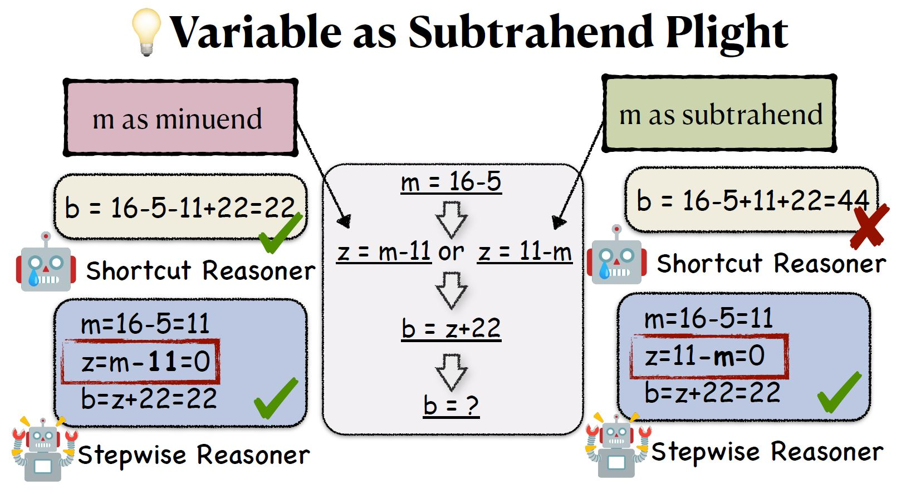
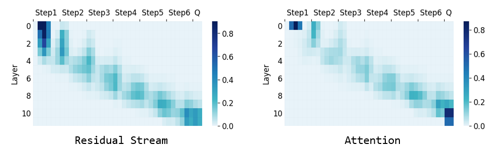
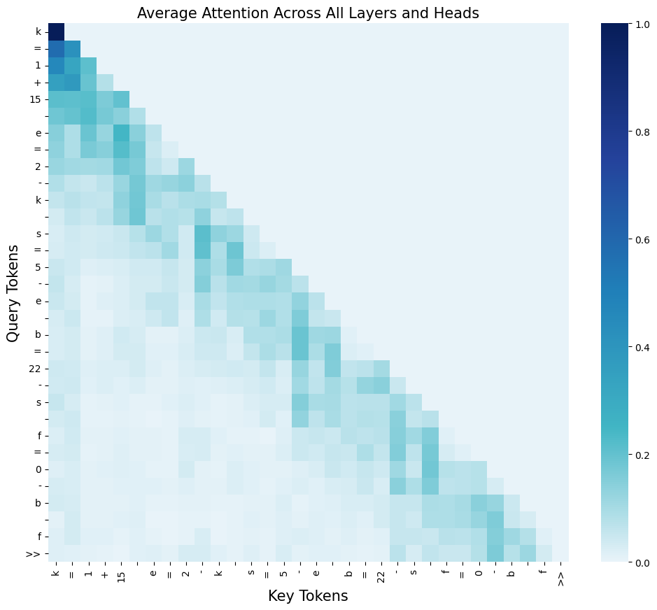
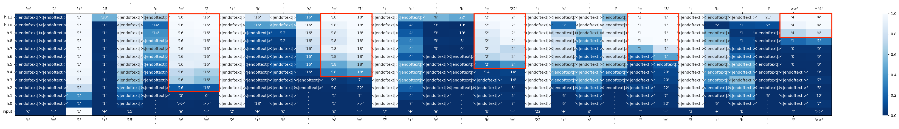
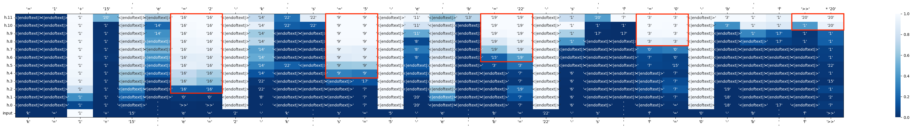

# LM-Implicit-Reasoning
Code for the Paper "[Implicit Reasoning in Transformers is Reasoning through Shortcuts](https://arxiv.org/abs/2503.07604)".

**TL;DR:** This paper finds LMs can perform stepwise implicit reasoning if trained on fixed pattern data, yet such a capability is through shortcuts and cannot generalize. Notably, we discover **"Variable as Subtrahend Plight"**. We find that when there are multiple expressions containing variables as the subtrahends in a problem, the LMs usually answers incorrectly. However, if there are no such expressions, the model can easily provide the correct answer.
<p align="center">

</p>

## A Quick Try
### Example in the Figure
```
m = 16 - 5
z = 11 - m
b = z + 22
What is the value of b? You must answer directly. Only output the final result. Begin your answer with "b = xx".
```
**Ground-Truth:** b=22

Both ``gpt-4o-2024-08-06`` and ``gpt-4o-2024-11-20`` will tell you the answer b=44, which is most likely calculated by b=16-5+11+22=44.

### Harder One
```
c = 13 - 4
w = 17 - c
f = 15 - w
What is the value of f? You must answer directly. Only output the final result. Begin your answer with "f = xx".
```
**Ground-Truth:** f=7

Almost all the state-of-the-art LLMs fail to answer this question correctly.

## Evaluating LLM
```bash
# Generate test data
cd ./src/testllm
python gen_testdata.py --step 3

# Test LLM
export OPENAI_API_BASE="your-api-base"
export OPENAI_API_KEY="your-api-key"
python test_llm.py --model gpt-4o-2024-08-06 --step 3 --order forward/reverse/random/Custom order(should match the length and not miss any index, e.g., 201)

```

## Training
### Environmental Setup
> [!NOTE]
> model.generate() will raise an error if your version is lower, since transformers deprecate PreTrainedModel inheriting from GenerationMixin, see [#33203](https://github.com/huggingface/transformers/pull/33203)

```bash
pip install torch
pip install transformers==4.46.1 
cd ./src/LLaMA-Factory-main
pip install -e ".[torch,metrics]"
```

### Data Preparation
Please refer to [sample data](https://github.com/TianheL/LM-Implicit-Reasoning/tree/main/src/LLaMA-Factory-main/data/example-5step-forward) for checking the details about the format of dataset files. We also provide a generation script to generate more data according to your needs.
1. Use `src/data/gen.ipynb` to generate data.
1. Use `src/data/convert_dataset.ipynb` to convert data to training format.

> [!NOTE]
> Please update `src/LLaMA-Factory-main/data/dataset_info.json` to use your custom dataset.

### Training GPT2-RoPE Model
Modified from HF [modeling_gpt2.py](https://github.com/huggingface/transformers/blob/1d2c29f0b32c084cf2e21890106681a4634ee41f/src/transformers/models/gpt2/modeling_gpt2.py). Please set `_attn_implementation=='eager'`.

Use the following command to initialize the GPT2-RoPE model and run fine-tuning.
```bash
cd ./src/model
python init_gpt2_rope.py
cd ../LLaMA-Factory-main
llamafactory-cli train examples/train_full/gpt2_rope_full_sft.yaml
```

### Evaluation
Use the following command to run evaluation.
```bash
cd ./src/eval
# Testset
python inference_testset.py
# 'Variable-as-Subtrahend' Testset
python inference_testset.py --testset_path ../data/test_vas.json --save_name all_items_vas.json
```

Use `get_acc.ipynb` and `get_acc_vas.ipynb` to visualize accuracy during the training stage

## Analysis
### Activation Patching
Use `src/analysis/activation_patching.ipynb` to identify important activations.
<p align="center">

</p>

### Attention Pattern
Use `src/analysis/attn_vis.ipynb` to visualize the attention scores between tokens, finding how each token focuses on others during implicit reasoning.
<p align="center">

</p>

### Logit Lens
Use `src/analysis/logit_lens.ipynb` to see where the model computes and stores intermediate results.

<p align="center">

</p>

<p align="center">

</p>


## Contact

If you have any problems, please contact 
[Tianhe Lin](mailto:thlin20@fudan.edu.cn).

## Citation Information

If our paper or related resources prove valuable to your research, we kindly ask for citation. 

<a href="https://github.com/TianheL/LM-Implicit-Reasoning"></a>

```
@misc{lin2025implicitreasoningtransformersreasoning,
      title={Implicit Reasoning in Transformers is Reasoning through Shortcuts}, 
      author={Tianhe Lin and Jian Xie and Siyu Yuan and Deqing Yang},
      year={2025},
      eprint={2503.07604},
      archivePrefix={arXiv},
      primaryClass={cs.CL},
      url={https://arxiv.org/abs/2503.07604}, 
}
```

## Acknowledgement
This repository references or uses the following open-source projects:
- [transformers](https://github.com/huggingface/transformers)
- [LLaMA-Factory](https://github.com/hiyouga/LLaMA-Factory)
- [GrokkedTransformer](https://github.com/OSU-NLP-Group/GrokkedTransformer)
- [transformer-utils](https://github.com/nostalgebraist/transformer-utils)

We appreciate the resources provided by these outstanding open-source projects.
